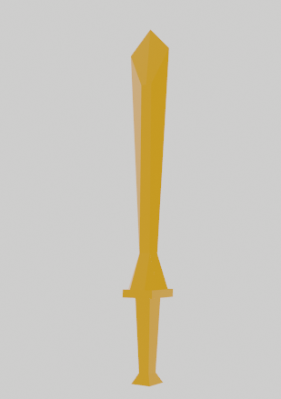
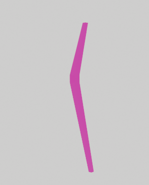
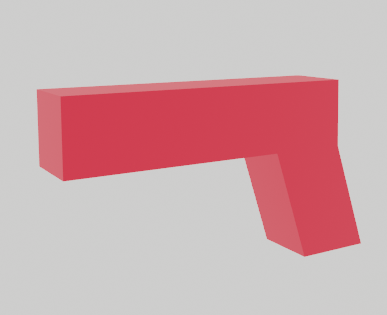
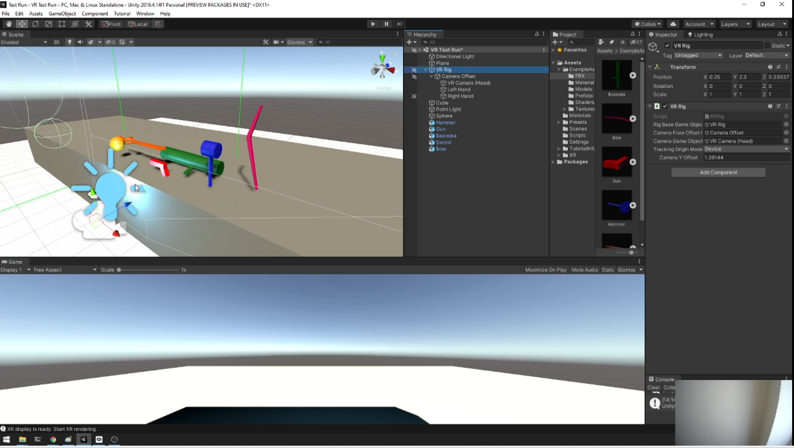
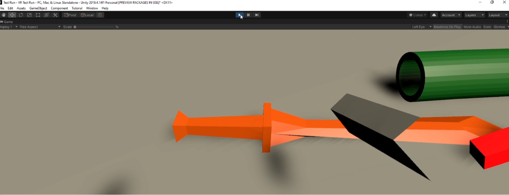
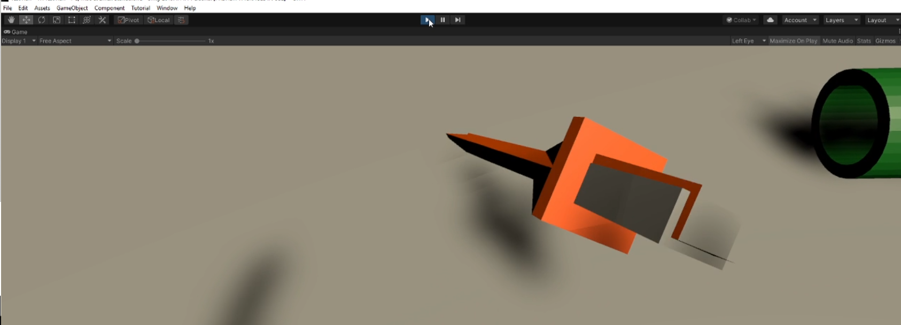
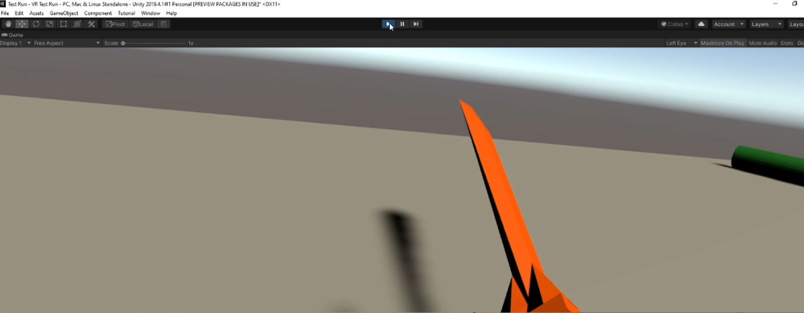
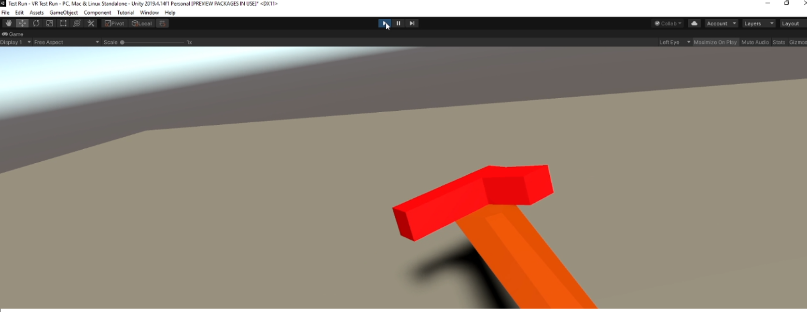

Jekko Syquia
Into the Dungeon 

<b> Design Overview:</b>
1. 
 This project is a dungeon crawler game. The first room will consist of the tutorial where the user are introduced to the weapons available to the game and have some practice moving around the game and getting comfortable with the controls. Once the user has finished the tutorial, the user can press a button in which the button will open up to a room where they start the first level. Each room is considered a level and will consist of a different item learned from the first tutorial. Enemies will spawn in for every room in which they have to defeat the enemies with the given tools. The tools given have their specific strengths against enemies. As they progress to each level, the user is introduced to a new weapon. By the end of the level, the user will have the option to use all the weapons available. 

1. 
There have been no changes to the development tools. Some of the development challenges is implementing proper physics with the game since the objects will be interacting with each other. Another challenge would be implementing AI for enemies, but that would be implemented later on, as I will be focusing on creating target practice for now and map levels.

<b> Implementation Status:</b>

<i><b>3D Models</b></i>
These 3D weapon models have been made in Blender and are subject to change. Enemey models are yet to be made.

<i>Sword</i>

<i>Hammer</i>

<i>Bow</i>

 
<i>Gun</i>

<i>Bazooka</i>

<i><b>Unity Setup Scene</b></i>

These are some early stages of development. Shown on the 3D viewer are the 5 weapons on the table currently at their initialize location since the game has not started.

<i><b>Gameplay Testing</b></i>

At this stage users are able to move around in their given position. Teleportation has not yet been implemented. However, object interaction and object physics can be seen in the following. Vr Interaction have been implemented using <b>XR Interaction Toolkit</b> available in <i>Unity</i>.

<b>Object Interaction</b>

 

User trying to grab a weapon. Hands are represented by a block as of now.

 

User with weapon grabbed. The grip on the item is still a work in progress and does not reflect the proper location of a grip. 

 
 

Early stages, users can grab the weapon and swing the item. This in turn has physics collider allowing users to also balance items onto another. This is by no means stable as they do not have proper physics reaction and all items have the same weight. Weapon damage has not been implemented as well and does not collide with certain items such as the table when it is already grabbed. Projectiles and swing physics will be implemented as of next.

