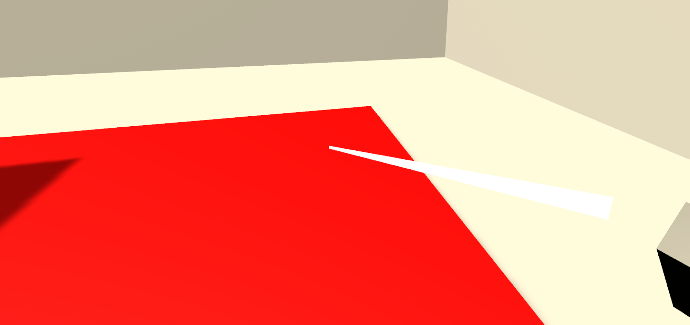
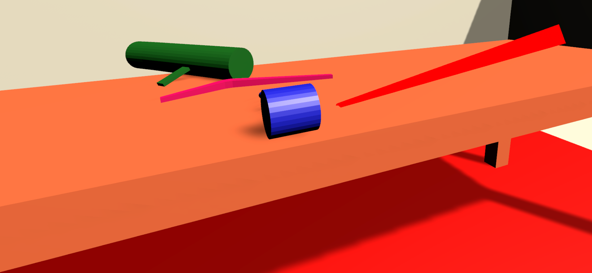

Jekko Syquia
Into the Dungeon 

<b> VR Development Platform and Device</b>
Unity Version
`Unity 2019.4.14f1`
Computer OS Version
`Windows 10 19042.746`
VR Headset Make and Model
`Oculus Quest`
<b>Learning:</b>

One of the major learning efforts that I have made was learning how to create models for my VR world. Such as learning from [Blender Guru](https://www.youtube.com/watch?v=TPrnSACiTJ4&list=PLjEaoINr3zgEq0u2MzVgAaHEBt--xLB6U&ab_channel=BlenderGuru) on Youtube. I have also made the effort of learning and reading the documentation [XR Plug-in Framework](https://docs.unity3d.com/Manual/XRPluginArchitecture.html) which handles most of my device settings. These proved to be helpful in development of our app doing our self-taught development process.

<b> Implementation Status:</b>

<i><b>3D Models</b></i>
I have created a better looking mockup of the level room made in Blender for the Into the Dungeon map. Examples are shown below:

<i>Wireframe version showing basic shading.</i>

<i>Render 1: I plan to bake the lighting to make it less demanding on the device but to also enable prebaked light for a more realistic experience. </i>

<i>An isometric view of the map so far. I will be adding new rooms soon.</i>

<i>Loaded in game this is the current setup. The render looks a lot different due to different rendering systems. However, this will be fixed later on when baked.</i>

<i><b>Gameplay Testing</b></i>
At this point I was able to import the map in the game. While the scaling may be off, it was still functional and mesh collision was added to the table and the room. 

<i>Harsh lighting can be seen on this basic map since the lighting is projected from one point.</i>

<i><b>Teleportation</b></i>

Users can teleport from one position to another. However, a main caveat is that once teleported it keeps them to initial perspective. Therefore, if the user was facing north any preceeding teleportation will keep them forward. This is still in development.

<i>Added a ray indicator for the teleportation. White means it is a valid teleportation area. Models are now available as a teleportation area as well.</i>

 

 

<i>A red ray indicator for areas that you cannot teleport has been added. The device table was not a teleportation area so it was not available for teleportation. This still needs work as the user can teleport under the table and collide with the table.</i>

