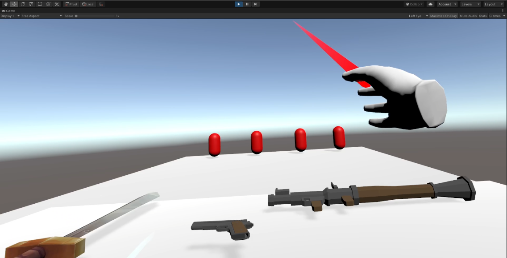

Jekko Syquia
Into the Dungeon

<b> VR Development Platform and Device</b>

Unity Version
`Unity 2019.4.19f1`
Computer OS Version
`Windows 10 19042.746`
VR Headset Make and Model
`Oculus Quest`

<b> Implementation Status:</b>

1. The VR design goals I was able to implement successfully are the following:
   - Player's head motions are in control the whole time.
     - The head motions are kept the same, therefore accurate to the users headset position.
   - Not overriding the field of view.
     - The field of view is kept the same, and did not add any effects on the wearer.
   - Avoided acceleration.
     - The speed is constant when moving to avoid motion sickness.
   - Screen space effects.
     - Similar with the field of view there are no edits made.
   - The frame rate was kept under 72 Hz.


<i><b>Scene Switch</b></i>

Below, I have created the option to move to the next room. This is still a work in progress I have also created the script SceneSwitcher to move to the next room. 
```C#
public void switchScene(){
        SceneManager.LoadScene(sceneIndex);
    }
```
This script is invoked when the button `Start` is invoked. Demo shown below:

<i>Demo showing scene transfer from <b>Tutorial Scene</b>.</i>

<i>Demo showing scene transfer to <b>Start Scene</b>.</i>


<i>Start Map showing the layout and the red are the enemies. Blue indicates the region in which the NavMeshAgent types can walk in</i>

<i><b>Enemy AI</b></i>

I have implemented my own script for creating an enemy AI that has 3 states. This uses the <b> Nav Mesh Agent</b> component to calculate the path to the player. The following states are:

1. Patrol

   - patrol the enemy moves randomly from the starting position.

   ```C#
    private void Patrolling()
   {
       if (!walkPointSet) GenerateWalkPoint();
       if (walkPointSet) agent.SetDestination(walkPoint);

       Vector3 distanceToWalkPoint = transform.position - walkPoint;

       // Reached the destination
       if (distanceToWalkPoint.magnitude < 1f)
           walkPointSet = false;
   }

   ```

   Above we can see the method `GenerateWalkPoint()` which calculates a random position for the enemy within the <b>x, z-axis.</b>

1. Chase
   - When a certain threshold is reached aka player is in <b>Sight Range</b>, the enemy starts chasing the player.
   ```C#
    private void ChasePlayer()
   {
       agent.SetDestination(player.position);
   }
   ```
   `agent` here is the NavMeshAgent passed in the script that calculates the next path to the player.
1. Attack

   - When chasing, if the player is in <b>Attack Range</b> the enemy is attacked with a bullet.

   ```C#
    private void AttackPlayer()
   {
       agent.SetDestination(transform.position);
       transform.LookAt(player);
       if (!alreadyAttacked)
       {
           // Attack here
           GameObject spawnedBullet = Instantiate(bullet, agent.transform.position, agent.transform.rotation);
           // To avoid collision within itself put it in the player layer
           spawnedBullet.layer = 12;

           // Provide rigid body to the instantiated bullet
           if (spawnedBullet.GetComponent<Rigidbody>() != null)
           {
               spawnedBullet.GetComponent<Rigidbody>().velocity = bulletSpeed * transform.forward;
           }
           else
           {
               spawnedBullet.AddComponent<Rigidbody>().velocity = bulletSpeed * transform.forward;
           }

           spawnedBullet.AddComponent<BulletDamage>().bulletDamage = 10;
           spawnedBullet.GetComponent<BulletDamage>().target = playerObject;

           // Play attack sound
           AudioSource audioSource = spawnedBullet.AddComponent<AudioSource>() as AudioSource;
           audioSource.PlayOneShot(bulletAudioClip);
           Destroy(spawnedBullet, 2);
           alreadyAttacked = true;
           Invoke(nameof(ResetAttack), timeBetweenAttacks);
       }
   }
   ```
   A few things are happening, here but the most important is that a `spawnedBullet` is created when the state is in attack. This component has a rigid body to simulate physics effects and also includes `AudioSource` to generate the bullet sound in the game. 
   This attack is similar to the player weapon script. 
   
Below is the script component attached to the enemy object.


<i><b>More on Enemy AI</b></i>

At this point my enemy AI are able to target the player and hit them as well. The chase works as intended. Enemy mesh is still work in progress but this will be implemented on the final map. 


<i>Above is a demo of <b>chase</b> state we can see the enemies are getting closer to the player and yellow objects are shown to indicate the bullet.</i>


<i>Above we can see projectiles from two enemies closely.</i>


<i>Above we can see projectiles being shot at the player. Since all the enemies are at range, all the enemies attack at a similar time.</i>

<i><b>Remaining challenges</b></i>

The remaining challenge is just to implement enemy mesh and a dungeon map for the player to walk in. Additionally, player and target health are a missing component to the game along with the bullet ammo.

I would likely be working on projectiles more than phsyical attacks to make it easier on the player. So the game, will be a dungeon with guns instead of swords.

Aside from this, the physics mechanics of the game is pretty much working and designing the mesh, and map will be the remaining challenge.

<b>Learning/Collaboration</b>
- What are the new skills you gained so far as you built your VR app? Provide details including the development tools, concepts, and procedures you could easily explain or teach to the beginners.  

The new skills I have gained was undoubtedly learning C# in Unity. One of the most significant aspect was dealing with AI and handling collisions that is triggered by the user. The tools I specifically used to handle AI is [NavMeshAgent](https://docs.unity3d.com/ScriptReference/AI.NavMeshAgent.html). This class in the UnityEngine.AI helps simplify the process of generating paths for the AI to follow, however, executing the paths still requires writing a script.
For example, below is baking a naigation for the floor. We can specify the properties of the "NavMeshAgent" which in this case is the red enemies. 

Proceeding to bake we get the following blue flooring below. This flooring indicates the Navigation area for the NavMeshAgents to move around or calculate the next step.


- How are you helping your team in the areas you became knowledgeable? 
For Bryan in my team I have suggested perhaps implementing a joystick for movement instead of constant movemnt of the head would be a good solution to prevent motion sickness from the movement. For Giana on the other hand, during group discussions I have provided some ideas on setting up her VR through Youtube tutorials such as Valem and choices for a VR device.
- Who helped you in your team or other teams if you received help or a great tip?
A great tip was not to include reload. Since we're focusing on user experience and comfortability, I think mitigating the extra steps to enjoy a VR game is important for a fun game. Therefore, the weapons are infinite.
- What was your collaboration like with your teammates and class? 
Collaboration with my teammates proved to be helpful, and I enjoy the process of sharing and exploring potential weaknesses to my design and their designs. This in turn help me gain some user perspective that benefited my development of my application and what not implement that will hinder a great user experience.

